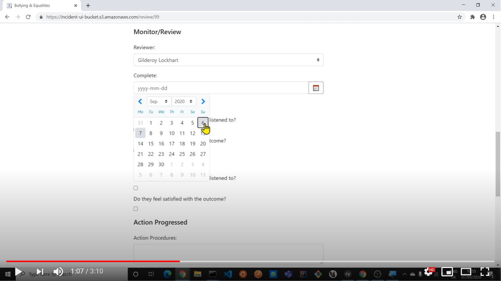

### Incident Management

##### Incident Management app for educational establishments

A clone of the incident management pages in the bullying and equalities module on SEEMIS
as described in [this document](https://www.abernet.org/mis/wp-content/uploads/sites/5/2017/03/How-to-Record-Incident.pdf) on abernet.org

##### Preview

##### See in HD

[Backend Code](https://github.com/eozgit/incident)

[Frontend Code](https://github.com/eozgit/incident-ui)

###### Stack
-   Angular 10
-   Java
-   Quarkus
-   Postgres
-   Docker
-   AWS CodeCommit
-   AWS CodeBuild
-   AWS CodePipeline
-   Amazon S3
-   AWS Lambda
-   Amazon API Gateway
-   Amazon RDS

###### Features
-   List incidents
-   Add incident
-   Review/Update incident
-   View incident
